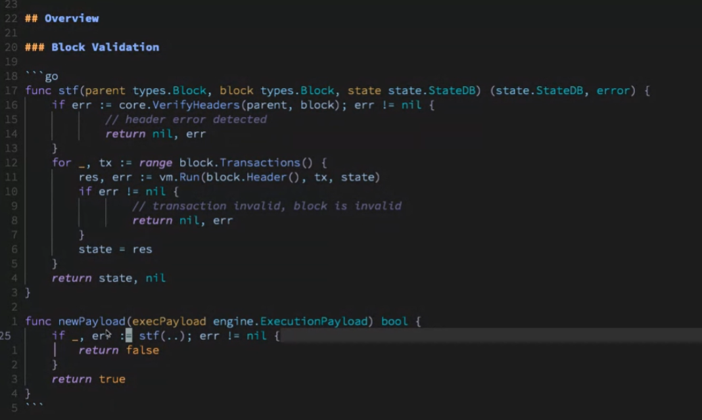
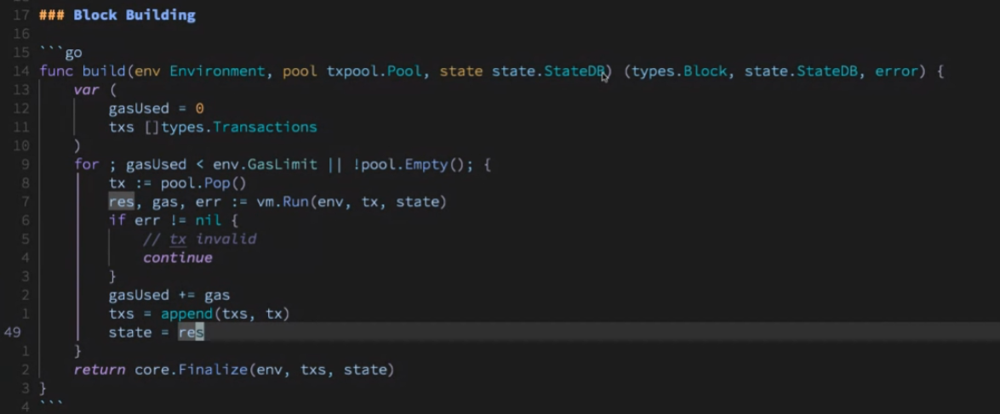

# Week 2 EPFsg Execution Layer Notes

## Guest speaker - Lightclient
- Lightclient - Ethereum core developer, Geth team member, also involved in Testing and EIP editing etc. 

## Summary notes
- Edited by Chloe Zhu
- Online version: https://ab9jvcjkej.feishu.cn/docx/BRDdd8kP9o00a2x6F4scRo0fnJh

## Overview of Block validation and Block building

### Block validation

Consensus Layer (CL): From the consensus specs, we can see how the CL thinks about EL
- Function process_execution_payload: 
  - It's performed by the beacon chain to verify whether a block is valid and move the CL forward. 
  - The CL will perform some checks (incl. parent hash, previous randao, timestamp, max blobs per block, etc.) and then send the payload to the EL for further verification.  
  - The communciation btw CL and EL is through the execution_engine.
  - Spec link: https://github.com/ethereum/consensus-specs/blob/dev/specs/deneb/beacon-chain.md#modified-process_execution_payload
- Function notify_new_payload
  - No implementation for the CL as it just sends the execution payloads to the execution engine, then the execution client will do the state transition function.
  - Spec link: https://github.com/ethereum/consensus-specs/blob/dev/specs/deneb/beacon-chain.md#modified-notify_new_payload

Excution layer (EL): Simple illustration written in Go

State transition function (STF)
- Parameters needed:
  - Parent block (Need to verify the transition logic from the parent to the current block)
  - Current block
  - StateDB (the last known valid state, which stores all of the state data with respect to the parent block)
- Return results:
  - Updated stateDB (incl. the info from the current block)
  - Error (if the function fails and does not update the StateDB)
- Step 1: Verify the headers
  - Error could happen if
    - The gas limit change exceeds 1/1024th of the previous block's
    - Block numbers are not sequential
    - EIP-1559 base fee is not updated correctly
    - etc.
- Step 2: Apply the Tx if the headers are correct
  - Range over the block tx, execute every tx through the VM, and update the state if the tx is corrent
  - Error could happen if 
    - There is an invalid tx, then the whole block is invalid, and the state won't be updated

Wrap function eg. newPayload
- Parameters needed: 
  - Execution payload
- Return results:
  - Return bool to the beacon chain
  - Then the beacon chain will call the STF

Q&A
- Why put block.header() into the vm.Run?
  - There are 2 pieces of context needed when executing the tx
    - The state: eg. Contract code, storage within the account etc.
    - The block context: eg. Parent hash, previous randao, base fee etc.
- The STF is called by the CL and gets returned whether it's valid. If it's not valid, what happens to CL?
  - The block is gonna be rejected.

### Block building
- Simple illustration written in Go

### Build Function

- Parameters needed
  - Environment: incl. Timestamps, block number, previous block, base fee, etc. 
  - Tx pool: Maintain the list of txns, ordered by their value
  - StateDB
- Return results
  - Block
  - Updated stateDB
  - Error 
- Step 1 Track gas used and store txs going to the block
  - The txs can be added into the block continuously until the gasUse limit is hit. Currently the mainnet gas limit is rougly 30m.
- Step 2 Get the next best tx from the tx pool and execute it
  - Use Pop() to get the next best tx, execute it through the VM, and append all the executed txs
  - If there is an error as the tx is invalid, the process will continue until there is no gas or the tx pool is empty.
- Step 3 Use Finalize function to return results
  - Finalize function takes txs and info about the block, and produces a fully assembled block. 

Q&A
- Is the txpool ordered in any way? If not, how do we ensure maximal profit when using pool.Pop?
  - Orderd by the highest paying tx to the builder
  - Every time you call Pop(), you will get the tx that is giving you the most value per gas.
- When building the block, does the EL reject any tx before sending it to the CL?
  - The only time you reject a tx is when it's invalid. In general, the tx pool would verify if the tx is valid, so this situation doesn't occur too much. 
- Encrypted mempools: 1. How viable is that? 2. Since block txs are ordered by gas price, is gas unencrypted under such design?
  - It's a challenging problem and there are many ideas on how to do it. Some might have unencrypted gas, some even have unencrypted sender info, but that all leaks some kind of info. 
  - From Ethereum perspective, this might be solved in the future when an efficient way to encrypt mempool is figured out.
- Whether there are any erase conditions to worry about here? eg. Tx from the mempool being incl. In the block and then be deleted before you build another block
  - The tx pool is supposed to do the tx verification, so generally the txs are valid here. But the pool is not always in sync and might cause some tx to be invalid, and the erase condition could happen. 
  
## Further dive into STF, EVM, and P2P protocol

### State transition function

Look into the geth code: https://github.com/ethereum/go-ethereum
Function newPayload
- It's invoked from the CL and the EL will do a bunch of integrity checks of the block info.
- It goes all the way down to the Function insertBlockWithoutSetHead, where we actually start to put the block into our chain. 
- Link: https://github.com/ethereum/go-ethereum/blob/master/eth/catalyst/api.go

Function insertBlockWithoutSetHead
- This function executes the block, runs verification, and then persists the block & tx state into the database. The key difference btw the InsertChain function is it won't do the canonical chain updating. It still relies on the additional SetCananical call to finalize the entire procedure. 
- Link: https://github.com/ethereum/go-ethereum/blob/master/core/blockchain.go

Function insertChain
- Function verifyHeaders: Checks whether a header conforms to the consensus rules of the
  - It will verify several items, such as the header's EIP-1559 attributes (to ensure the gas limit is within the allowed bound), gas limit, gas used, timestamp etc., and make sure all the fields are correct. 
  - Once the headers are verified, then the block can be executed. 
  - Link: https://github.com/ethereum/go-ethereum/blob/master/consensus/beacon/consensus.go
- Function Process
  - Parameters needed incl. Block, stateDB, vm config
  - State Transition in Geth is through state_processor
    - The flow is similar to the STF overview above, but with more details.
  - Link: https://github.com/ethereum/go-ethereum/blob/master/core/types.go
  - Link: https://github.com/ethereum/go-ethereum/blob/master/core/state_processor.go
  - Once the process is done, the blockchain will update some more metrics and eventually write the block to the state. 

Q&A
- What's a Receipt?
  - A receipt is information about a transaction that can only be verified or determined after executing the transaction.
  - Link: https://github.com/ethereum/go-ethereum/blob/master/core/types/receipt.go
- Question regarding the environment of multiple transactions which result in multiple other transactions: How is the context environment that you use? How is it fetched?
  - EVM environment: 
    - Transaction level context: Might change within the block, eg. Gas price, blob etc.
    - Block level context: Fixed across the entire block, eg. Block number, base fee, time difficulty etc.
    - Link: https://github.com/ethereum/go-ethereum/blob/master/core/state_processor.go
  - EVM interpreter: 
    - ScopeContext: Change within the tx, eg. Memory, stack, contract
    - Link: https://github.com/ethereum/go-ethereum/blob/master/core/vm/interpreter.go

### EVM

EVM structure
- Imagine the area is the EVM call frame, which changes throughout the tx. Within the EVM call frame, there are:
[Image]
  - Code
  - PC (Program Counter): If PC is at 0, the interpreter will load the instruction at index is 0 in the code, then execute it. Then it would update the PC by 1 byte. 
  - Stack
  - Memory
  - Gas remaining
  - Block context & Tx context
  - State
- Example on stack machine simulation: https://www.evm.codes/playground

Different types of instructions within the EVM
- Arithmetic: eg. Add, subtract, exponentiate etc.
- Bitwise: eg. Bigbang etc.
- Environment: Give the access to block context and Tx context
- Control flow: For more complicated program, eg. Branch (EIP 4788)
  - Link: https://github.com/lightclient/4788asm
- Stack ops: eg. push, pop, swap etc.
- System: eg. call, create, return, sstorage etc.
- Memory: eg. mload, mstore, mstore8 etc.

Q&A
- How were the various instruction costs determined? Are they basically incentives to reduce the load of the network?
  - There is a target gas per second, which is a benchmark for the cost decision. Today a lot of the instructions just use what the gas cost of other similar types of instructions as the benchmark. 

p2p protocol
- The EL operates on devp2p, which is the bespoken protocol of Ethereum. 
Funny history of devp2p protocol naming: 
- Now we are at eth/68, working towards eth/69. In early days, there were quick iterations of the protocol from eth/1 to eth/6, then it changed to eth/60, /61, /62, and now /68. Logical 😂😂
- Link: https://github.com/ethereum/devp2p

Responsibility of the p2p protocol: Access to historical data & pending txs, and the state
- Link: https://github.com/ethereum/devp2p/blob/master/caps/eth.md
- Historical data: 3 methods to get the historical data from Ethereum
  - GetBlockHeaders: Require peer to return a blockheaders message
  - GetBlockBodies: Request block body data by hash
  - GetReceipts: Require peer to return a receipts message containing the receipts of the given block hashs
- Pending txns (not yet in a block)
  - Transactions: Specify txs that the peer should make sure is included on its tx queue
  - NewPooledTransactionHashes: Send a list of tx types, sizes, hashes of the tx to peer; If the peer hasn't seen the tx hashes before, then it will call GetPooledTransactions function
    - The goal is to reduce the bandwidth of the execution client by sending the full txs only to a square root of the peer, instead of every peer 
  - GetPooledTransactions: The pool will respond with the full tx values
- State
  - Link: https://github.com/ethereum/devp2p/blob/master/caps/snap.md
  - Snap sync: It can be seen as a 2-phase protocol. The 1st phase is contiguous state retrieval, and the 2nd is healing phase in order to sync the state trie.
  
Q&A
- How do you know you are not downloading the wrong data from the wrong chain?
  - The process would be
    - Start with the weak subjectivity checkpoint, which will give a root
    - Get the block associated with the hash
    - Start snap against that block state
  - The state root you are snapping sync with is authenticated by you, so you assume it is correct and download the state. The data you get back would be a witness against the root. 
  - The only thing that could possibly happen is that the state was computed incorretly and you downloaded the corrupted state that the chain has accepted. That is extremely unlikely to happen as we have the economic majority verifying the chain. 